# Awesome Enterprise Browser Platform 🛡️🌐

  
  
  
  
  
  

## 🚀 Top Enterprise Browser Platforms Ecosystem

**Curated List of SaaS Products & Open-Source GitHub Projects**

*Focused on Secure Enterprise Browsers, Remote Browser Isolation (RBI), Last-Mile Controls, Data Loss Prevention (DLP), BYOD Protection & Zero-Trust Web Access*

**Last updated: September 2026** 📅

---

## 📌 Overview

This repository tracks market-leading **SaaS platforms** and high-impact **open-source projects** for **Enterprise Browser** solutions. Enterprise Browsers harden or replace the corporate browser with granular policy enforcement, in-browser data loss prevention (DLP), remote browser isolation (RBI), session controls, threat prevention, and zero-trust access to SaaS and internal web applications.

**Category Leaders** include Island, Talon Security (Palo Alto Networks), Google Chrome Enterprise Premium, Microsoft Edge for Business, Cloudflare Browser Isolation, Menlo Security, LayerX, and Seraphic Security.

**Open-Source Focus**: Purpose-built enterprise browsers and commercial RBI stacks are primarily proprietary. However, powerful open-source tools focus on containerized web streaming (BrowserBox, Kasm Workspaces VNC, abcdesktop), identity-aware zero-trust proxies (Teleport, OAuth2-Proxy, Pomerium), and browser automation runtimes (Playwright, Selenium). This guide helps security architects and IT engineers bridge the gap between commercial fleets and self-hosted solutions.

---

## 📑 Table of Contents

- [☁️ SaaS/Hosted Platforms](#️-saashosted-platforms)
- [💻 Open-Source GitHub Projects](#-open-source-github-projects)
- [🤝 How to Contribute](#-how-to-contribute)
- [💖 Support & Sponsorship](#-support--sponsorship)
- [📈 Star History](#-star-history)
- [⚠️ Disclaimer](#️-disclaimer)

---

## ☁️ SaaS/Hosted Platforms

> **📊 Market Insights & Landscape**:  
> The Enterprise Browser & Remote Browser Isolation (RBI) market size is estimated at **$3.5B to $5.0B+** (growing rapidly at a ~20%+ CAGR). The market structure is **moderately fragmented**, undergoing consolidation as SASE leaders (e.g., Palo Alto Networks acquiring Talon) acquire specialized browser security startups, while standalone pioneers (e.g., Island, Menlo Security) build category-defining platforms alongside tech giants (Google Chrome Enterprise, Microsoft Edge for Business).

### 🏢 SaaS Product Matrix & Pricing

Below is a comparative breakdown of commercial enterprise browser and browser security platforms, sorted by estimated company size / valuation (descending):

| Product / Platform 🏢 | Valuation / Revenue 💰 | Starting Pricing Tier 🏷️ | Free Tier / Trial Limits ⏳ | Key Capabilities & Focus 🛡️ |
| :--- | :--- | :--- | :--- | :--- |
| **[Microsoft Edge for Business](https://www.microsoft.com/edge/business)** | **$3.1 Trillion** (Parent Mkt Cap) | Included in M365 Business Premium ($22/user/mo) | Free tier available via standard Edge; enterprise controls included with M365 subscriptions | Native enterprise Edge browser integrated with M365, Entra ID Conditional Access, and Defender. |
| **[Google Chrome Enterprise Premium](https://chromeenterprise.google/)** | **$2.0 Trillion** (Parent Mkt Cap) | $6.00 / user / month | Chrome Enterprise Core is free; Premium includes 30-day free trial for up to 50 users | Managed Chrome experience with deep DLP, malware inspection, URL filtering, and context-aware access. |
| **[Citrix Secure Browser](https://www.citrix.com/)** | **$15.0 Billion** (Acquisition / Private Value) | $7.00 / user / month (Citrix DaaS add-on) | 30-day corporate evaluation trial upon enterprise request | Virtualized browser isolation and disposable browser session delivery integrated with Citrix Workspace. |
| **[Talon Security (Prisma Access Browser)](https://www.talon-sec.com/)** | **$625 Million** (Acquired by Palo Alto Networks) | $7.00 / user / month | 14-day enterprise proof-of-concept (PoC) trial upon request | Enterprise Chromium browser tightly integrated with Palo Alto Networks SASE / Prisma Access controls. |
| **[Island](https://www.island.io/)** | **$3.0 Billion** (Series D Valuation) | $8.00 / user / month | 14-day managed enterprise PoC trial with full admin portal access | Purpose-built enterprise browser with deep DLP, watermarking, session recording, and GenAI security. |
| **[Menlo Security](https://www.menlosecurity.com/)** | **$800 Million** (Series E Valuation) | $12.00 / user / month | 30-day enterprise evaluation trial upon request | Remote browser isolation (RBI) platform executing untrusted active web content in disposable cloud containers. |
| **[Authentic8 Silo](https://www.authentic8.com/)** | **$250 Million** (Estimated Valuation) | $15.00 / user / month (Silo for Safe Access) | 30-day free trial available for organizations | Cloud-hosted disposable browser environment isolating web sessions for secure research and governance. |
| **[Cloudflare Browser Isolation](https://www.cloudflare.com/)** | **$35.0 Billion** (Public Market Cap) | $10.00 / user / month (Zero Trust Add-on) | Free Tier up to 5 users on Cloudflare Zero Trust (RBI add-on requires Pay-as-you-go or Contract) | Vector rendering remote browser isolation integrated with Cloudflare's global edge network. |
| **[LayerX](https://layerxsecurity.com/)** | **$100 Million** (Estimated Valuation) | $5.00 / user / month | 14-day enterprise trial for BYOD & browser security extension | Extension-based browser security layer protecting existing browsers, BYOD, and SaaS/GenAI risks. |
| **[Seraphic Security](https://seraphicsecurity.com/)** | **$50 Million** (Estimated Valuation) | $6.00 / user / month | 14-day enterprise trial upon request | In-browser security engine providing exploit protection, governance, and DLP across any standard browser. |

---

## 💻 Open-Source GitHub Projects

Below are top open-source projects for self-hosting browser isolation, zero-trust access proxies, remote browser engines, and enterprise browser tooling. 

*Sorted by GitHub Stars_Count (Descending)* ⭐

| Repository 📦 | GitHub_Stars ⭐ | Primary Focus & Description 🛠️ |
| :--- | :--- | :--- |
| **[microsoft/playwright](https://github.com/microsoft/playwright)** |  | Node.js/Python library to automate Chromium, Firefox, and WebKit—foundational for custom browser isolation engines and automated security auditing. |
| **[seleniumhq/selenium](https://github.com/seleniumhq/selenium)** |  | Core browser automation framework across all major browsers, widely used for browser sandbox orchestration and security policy test suites. |
| **[chromium/chromium](https://github.com/chromium/chromium)** |  | The open-source base for Google Chrome, Island, Talon, Edge, and Brave—essential foundation for custom enterprise browser builds. |
| **[teleport/teleport](https://github.com/gravitational/teleport)** |  | Identity-aware zero-trust access proxy and session recorder for infrastructure, web applications, and internal HTTP endpoints. |
| **[oauth2-proxy/oauth2-proxy](https://github.com/oauth2-proxy/oauth2-proxy)** |  | Reverse proxy providing authentication using OAuth 2.0 / OIDC providers (Google, Okta, Azure AD) to front internal web apps. |
| **[pomerium/pomerium](https://github.com/pomerium/pomerium)** |  | Identity-aware context proxy providing zero-trust access control to web apps without requiring a client VPN. |
| **[kasmtech/kasmvnc](https://github.com/kasmtech/kasmvnc)** |  | Modern web-based VNC server optimized for remote browser streaming and containerized desktop environments over WebSockets. |
| **[BrowserBox/BrowserBox](https://github.com/BrowserBox/BrowserBox)** |  | Open-source Remote Browser Isolation (RBI) platform for secure, containerized web sessions away from endpoint devices. |
| **[mysteriumnetwork/node](https://github.com/mysteriumnetwork/node)** |  | Decentralized network node stack providing encrypted routing for privacy-preserving and isolated web traffic. |
| **[linuxserver/docker-firefox](https://github.com/linuxserver/docker-firefox)** |  | Containerized Firefox browser with WebRTC/KasmVNC streaming interface for disposable endpoint isolation. |
| **[abcdesktopio/oc.user](https://github.com/abcdesktopio/oc.user)** |  | Kubernetes-native virtual desktop and remote application/browser isolation platform using disposable containers. |

---

## 🛠️ Architecture Framework for Open-Source Deployment

To build a zero-trust enterprise browsing stack using open-source components:

1. **Deploy Open RBI Engine**: Host **BrowserBox** or **KasmVNC + Docker-Firefox** in containerized cloud environments.
2. **Enforce Identity & Access**: Place **Pomerium**, **Teleport**, or **OAuth2-Proxy** in front of web applications for authentication.
3. **Configure Fleet Policies**: Apply managed Chromium JSON policy templates to endpoints for device governance.
4. **Audit & Session Logs**: Route traffic through identity proxies to capture session audits and access logs.

---

## 🤝 How to Contribute

Contributions are welcome! Please follow these simple steps to add or update entries:

1. Fork this repository 🍴
2. Create your feature branch (`git checkout -b feature/add-platform`)
3. Add the platform or tool to `README.md` following the table structure
4. Ensure factual information, link to official documentation, and specify license/pricing
5. Submit a Pull Request (PR) with a clear summary 🚀

---

## 💖 Support & Sponsorship

If you find this repository helpful for your security research, architecture planning, or zero-trust deployment, please consider supporting the project:

- 🌟 **Star this repository** to help others discover it!
- 🔀 **Fork & Share** with your cybersecurity team and security engineering colleagues.
- ☕ **Buy me a coffee**: Support ongoing maintenance and research via the [GitHub Sponsor Dashboard](https://github.com/sponsors/ishandutta2007).

Thank you for supporting open cybersecurity resources! 🙌

---

## 📈 Star History

---

## ⚠️ Disclaimer

- This list is **community-curated** for educational and architectural research purposes—it is not an exhaustive directory or commercial endorsement.
- Enterprise Browsers and Remote Browser Isolation systems impact security controls and user workflow. Always conduct security assessments before deploying enterprise controls.
- Product logos, trademarks, and brand names belong to their respective owners.

---

  <b>Made with ❤️ for Security Architects, IT Leaders & Zero-Trust Engineers.</b>

